# Code-encoding-fix

<div align="center">

**One-click UTF-8 encoding configuration for Windows terminals — Fix garbled Chinese characters in Codex CLI, PowerShell, and Git Bash**

[](./LICENSE)
[](./README.md)
[](https://github.com/hellowind777/Code-encoding-fix/releases)
[](https://github.com/hellowind777/Code-encoding-fix/pulls)
[]()

[简体中文](./README_CN.md) · [English](./README.md) · [Quick Start](#-quick-start) · [Features](#-features)

</div>

---

> **Important:** This tool is designed exclusively for Windows systems. It configures UTF-8 encoding across PowerShell, Git Bash, VS Code, and Windows Console to eliminate garbled text (乱码) issues.

---

## 🎯 Why Code-encoding-fix?

**The Problem:** Windows terminals default to legacy code pages (e.g., CP936 for Chinese), causing Chinese characters to display as garbled text (乱码) when using Codex CLI, Claude Code, or other modern development tools.

**The Solution:** A single GUI tool that automatically detects and configures UTF-8 encoding across all your Windows terminals and development tools.

| Challenge | Without Code-encoding-fix | With Code-encoding-fix |
|-----------|---------------------------|------------------------|
| **Chinese output in terminals** | Garbled characters (乱码) | Clean UTF-8 text |
| **Codex CLI / Claude Code** | Encoding errors and crashes | Works seamlessly |
| **Multiple tools to configure** | Manual editing of 4+ config files | One-click setup |
| **Configuration consistency** | Different settings per tool | Unified UTF-8 everywhere |
| **Rollback capability** | No easy way to restore | Built-in backup & restore |

### 💡 Best For
- ✅ **Windows developers** experiencing Chinese character encoding issues
- ✅ **Codex CLI / Claude Code users** who need proper UTF-8 support
- ✅ **Teams** who want consistent encoding across PowerShell, Git Bash, and VS Code
- ✅ **Anyone** tired of manually configuring UTF-8 in multiple tools

### ⚠️ Not For
- ❌ macOS or Linux users (native UTF-8 support)
- ❌ Users who only work with ASCII/English text
- ❌ Systems where you cannot modify user-level registry settings

---

## ✨ Features

### 🎯 Core Capabilities

<table>
<tr>
<td width="50%">

**🔍 Auto-Detection**

- Detects Windows PowerShell 5.1
- Detects PowerShell 7+
- Detects Git Bash installation
- Detects VS Code settings
- Detects Windows Terminal

**Your benefit:** No manual path hunting — the tool finds everything automatically.

</td>
<td width="50%">

**⚡ One-Click Configuration**

- PowerShell profile UTF-8 settings
- Git Bash ~/.bashrc encoding
- VS Code settings.json
- Console registry CodePage (65001)

**Your benefit:** Configure all tools in seconds instead of hours.

</td>
</tr>
<tr>
<td width="50%">

**🔄 Backup & Restore**

- Automatic backup before any changes
- Restore to original state anytime
- Separate backups per tool
- "Reset to System Default" option

**Your benefit:** Safe experimentation — always revert if needed.

</td>
<td width="50%">

**🛡️ Drift Detection**

- Detects manual config modifications
- Identifies partial/broken configurations
- Reports exact differences from expected
- Auto-cleanup of orphaned markers

**Your benefit:** Know exactly what changed and when to re-apply settings.

</td>
</tr>
</table>

### 📊 By the Numbers
- **4 tools** configured simultaneously (PowerShell 5.1, PowerShell 7+, Git Bash, VS Code)
- **5 consoles** with CodePage set (PS5, PS7, Windows Terminal, CMD, custom)
- **Zero** manual file editing required
- **100%** reversible with built-in restore

---

## 🚀 Quick Start

### Prerequisites
- Windows 10 or later
- Python 3.10+ (for running from source) OR
- Download pre-built `.exe` from [Releases](https://github.com/hellowind777/Code-encoding-fix/releases)

### Installation

**Option 1: Download Pre-built Executable (Recommended)**

```powershell
# Download from GitHub Releases
# https://github.com/hellowind777/Code-encoding-fix/releases
# Run Code-encoding-fix.exe directly
```

**Option 2: Run from Source**

```powershell
# Clone the repository
git clone https://github.com/hellowind777/Code-encoding-fix.git
cd Code-encoding-fix

# Run the application
python Code-encoding-fix.py
```

### First Use

1. **Launch the application** — The GUI will auto-detect all installed tools
2. **Click "开始执行配置"** (Start Configuration) — All detected tools will be configured
3. **Restart your terminals** — PowerShell, Git Bash, VS Code need restart to apply changes

**Expected Output:**
```
[SUCCESS] 检测到 Windows PowerShell 5.1: C:\Windows\System32\WindowsPowerShell\v1.0\powershell.exe
[SUCCESS] 检测到 Git Bash: C:\Program Files\Git\bin\bash.exe
[SUCCESS] 检测到 Visual Studio Code: C:\Users\...\Code.exe
[SUCCESS] 已写入 Windows PowerShell 5.1 UTF-8 用户配置
[SUCCESS] 已写入 Git Bash UTF-8 用户配置
[SUCCESS] 已写入 Visual Studio Code UTF-8 用户设置
[SUCCESS] Windows PowerShell 5.1 控制台已设置为 UTF-8 代码页
```

### Verify Installation

After restarting PowerShell:
```powershell
# Check current code page
chcp
# Expected: Active code page: 65001

# Test Chinese output
echo "你好世界"
# Expected: 你好世界 (not garbled)
```

---

## 🔧 How It Works

### Architecture Overview

```mermaid
flowchart TD
    Start([Launch App]) --> Detect{Auto-Detect<br>Installed Tools}

    Detect -->|Found| PS5[Windows PowerShell 5.1]
    Detect -->|Found| PS7[PowerShell 7+]
    Detect -->|Found| Git[Git Bash]
    Detect -->|Found| VSC[VS Code]

    PS5 --> Backup1[Backup Original Config]
    PS7 --> Backup2[Backup Original Config]
    Git --> Backup3[Backup Original Config]
    VSC --> Backup4[Backup Original Config]

    Backup1 --> Config1[Write UTF-8 Profile]
    Backup2 --> Config2[Write UTF-8 Profile]
    Backup3 --> Config3[Write .bashrc]
    Backup4 --> Config4[Update settings.json]

    Config1 --> Registry[Set Console<br>CodePage 65001]
    Config2 --> Registry
    Config3 --> Registry
    Config4 --> Registry

    Registry --> Done([✅ Configuration Complete<br>Restart Terminals])

    style Start fill:#e3f2fd
    style Done fill:#4caf50,color:#fff
    style Registry fill:#fff3e0
```

<details>
<summary><strong>📊 Click to view full architecture diagram</strong></summary>



</details>

### Configuration Details

<table>
<tr><th>Tool</th><th>What Gets Configured</th><th>Config Location</th><th>Key Settings</th></tr>

<tr>
<td><strong>Windows PowerShell 5.1</strong></td>
<td>
• Console encoding<br>
• Input/Output encoding<br>
• Default parameter encoding<br>
• LANG environment variable
</td>
<td>~\Documents\WindowsPowerShell\Microsoft.PowerShell_profile.ps1</td>
<td>
• chcp 65001<br>
• [Console]::*Encoding = UTF8<br>
• $PSDefaultParameterValues['*:Encoding'] = 'utf8'
</td>
</tr>

<tr>
<td><strong>PowerShell 7+</strong></td>
<td>
• Same as PowerShell 5.1
</td>
<td>~\Documents\PowerShell\Microsoft.PowerShell_profile.ps1</td>
<td>
• Same settings as PS 5.1
</td>
</tr>

<tr>
<td><strong>Git Bash</strong></td>
<td>
• LANG/LC_ALL variables<br>
• Git encoding settings<br>
• Console code page
</td>
<td>~/.bashrc</td>
<td>
• export LANG="zh_CN.UTF-8"<br>
• git config --global core.quotepath false<br>
• git config --global i18n.commitencoding utf-8
</td>
</tr>

<tr>
<td><strong>VS Code</strong></td>
<td>
• File encoding<br>
• Terminal environment<br>
• Auto-guess encoding
</td>
<td>%APPDATA%\Code\User\settings.json</td>
<td>
• "files.encoding": "utf8"<br>
• "terminal.integrated.env.windows": LANG/LC_ALL
</td>
</tr>

<tr>
<td><strong>Console Registry</strong></td>
<td>
• CodePage per application
</td>
<td>HKCU\Console\{app}</td>
<td>
• CodePage = 65001 (UTF-8)
</td>
</tr>

</table>

### Real Example: Before/After

```
Before (default Windows encoding):
  PowerShell output: ????
  Git log: <E4><BD><A0><E5><A5><BD>
  VS Code terminal: 浣犲ソ

After (UTF-8 configured):
  PowerShell output: 你好世界
  Git log: 修复编码问题
  VS Code terminal: 你好世界
```

---

## 📖 Documentation

### Core Concepts

<table>
<tr><th>Concept</th><th>Definition</th><th>Why It Matters</th></tr>

<tr>
<td><strong>Code Page</strong></td>
<td>Windows system for mapping byte sequences to characters. CP936 = GBK Chinese, CP65001 = UTF-8</td>
<td>Wrong code page = garbled text. UTF-8 (65001) is the modern universal standard.</td>
</tr>

<tr>
<td><strong>Console Encoding</strong></td>
<td>The encoding used by terminal applications for input/output</td>
<td>Must match between shell and applications for correct display.</td>
</tr>

<tr>
<td><strong>Profile Script</strong></td>
<td>PowerShell script that runs at startup to configure the environment</td>
<td>Ensures UTF-8 settings persist across sessions.</td>
</tr>

<tr>
<td><strong>Configuration Drift</strong></td>
<td>When actual config differs from expected (manual edits, updates)</td>
<td>Tool detects drift and can re-apply correct settings.</td>
</tr>

</table>

### GUI Buttons

| Button | Function | When to Use |
|--------|----------|-------------|
| `开始执行配置` | Apply UTF-8 configuration to all detected tools | First setup or after drift detected |
| `恢复配置` | Restore all tools to pre-configuration state | When you want to undo all changes |
| `恢复系统默认(不含工具)` | Reset console CodePage to system default | When only console needs reset |
| `重新检测` | Re-scan for installed tools and check config status | After installing new tools |
| `备份目录` | Open the backup storage folder | To view or manage backups |
| `打开` | Open the config file for that tool | To manually inspect or edit |

---

## ❓ FAQ

<details>
<summary><strong>Q: Do I need administrator privileges?</strong></summary>

**A:** No. This tool only modifies user-level settings:
- User profile scripts (not system-wide)
- User VS Code settings
- HKCU registry keys (not HKLM)

No elevation or admin rights required.
</details>

<details>
<summary><strong>Q: Will this break my existing PowerShell profile?</strong></summary>

**A:** No. The tool:
1. Creates a backup before any modifications
2. Uses clearly marked blocks that can be identified and removed
3. Provides a one-click restore function

Your existing profile content is preserved outside the marked blocks.
</details>

<details>
<summary><strong>Q: Why do I need to restart terminals after configuration?</strong></summary>

**A:** Terminals load their configuration at startup. Changes to:
- PowerShell profile scripts
- VS Code settings
- Console registry settings

...only take effect when the application restarts and reloads its config.
</details>

<details>
<summary><strong>Q: Can I run this tool multiple times?</strong></summary>

**A:** Yes, the tool is idempotent. It:
- Detects existing configuration blocks
- Removes old blocks before writing new ones
- Won't create duplicate entries

Running multiple times is safe and produces the same result.
</details>

<details>
<summary><strong>Q: What if I only have Git Bash installed (no PowerShell 7)?</strong></summary>

**A:** The tool auto-detects what's installed. It will:
- Configure Windows PowerShell 5.1 (always present on Windows)
- Skip PowerShell 7 with a warning
- Configure Git Bash
- Configure VS Code (if installed)

Missing tools are simply skipped.
</details>

<details>
<summary><strong>Q: Does this affect system-wide settings?</strong></summary>

**A:** No. All changes are user-scoped:
- Profile scripts are in your user Documents folder
- Registry changes are under HKEY_CURRENT_USER
- VS Code settings are per-user

Other users on the same machine are not affected.
</details>

<details>
<summary><strong>Q: How do I completely remove all changes?</strong></summary>

**A:** Click "恢复配置" (Restore Configuration) to:
1. Restore all profile scripts from backup
2. Reset console CodePage to original values
3. Restore VS Code settings
4. Clean up backup files

This returns everything to the pre-configuration state.
</details>

---

## 🛠️ Troubleshooting

### PowerShell still shows garbled text after configuration

**Problem:** Chinese characters still display incorrectly after running the tool.

**Cause:** Terminal not restarted, or using a different PowerShell profile.

**Solution:**
```powershell
# 1. Close ALL PowerShell windows
# 2. Open a NEW PowerShell window

# 3. Verify the profile loaded
$PROFILE
# Should show: C:\Users\{you}\Documents\WindowsPowerShell\Microsoft.PowerShell_profile.ps1

# 4. Check current encoding
[Console]::OutputEncoding
# Should show: UTF-8 (CodePage 65001)
```

---

### "未检测到 PowerShell 7+" warning

**Problem:** Tool reports PowerShell 7 not found, but you have it installed.

**Cause:** PowerShell 7 installed in non-standard location or not in PATH.

**Solution:**
```powershell
# Check if pwsh is available
where.exe pwsh

# If not found, add to PATH or reinstall PowerShell 7
# Download from: https://github.com/PowerShell/PowerShell/releases
```

---

### VS Code terminal still has encoding issues

**Problem:** VS Code integrated terminal shows garbled text.

**Cause:** VS Code settings not reloaded, or workspace settings override user settings.

**Solution:**
```
1. Press Ctrl+Shift+P
2. Type "Reload Window" and press Enter
3. Check for workspace-level settings that might override:
   .vscode/settings.json in your project
```

---

### Git log shows escaped characters like `<E4><BD><A0>`

**Problem:** Git commit messages display as hex codes instead of Chinese.

**Cause:** Git's core.quotepath is set to true (default).

**Solution:**
```bash
# This tool sets this automatically, but verify:
git config --global core.quotepath
# Should return: false

# If not, set manually:
git config --global core.quotepath false
```

---

### Configuration drift detected after Windows Update

**Problem:** Tool reports "已偏离" (drift detected) after system updates.

**Cause:** Windows updates sometimes reset registry values or profile permissions.

**Solution:**
```
1. Click "开始执行配置" to re-apply settings
2. The tool will backup current state and rewrite correct values
3. Restart affected terminals
```

---

## 🤝 Contributing

1. **Fork** the repository
2. **Create** a feature branch (`git checkout -b feature/amazing`)
3. **Commit** your changes (`git commit -m 'Add amazing feature'`)
4. **Push** to the branch (`git push origin feature/amazing`)
5. **Open** a Pull Request

### Contribution Ideas
- 🐛 Found a bug? [Report it](https://github.com/hellowind777/Code-encoding-fix/issues)
- 💡 Have an idea? [Discuss it](https://github.com/hellowind777/Code-encoding-fix/discussions)
- 📝 Improve docs? PRs for typos always welcome!
- 🌍 Translate? We need help with Japanese, Korean, etc.

---

## 🔒 Security

**This tool is safe to use:**

- ✅ No network requests — works completely offline
- ✅ No data collection — your settings stay local
- ✅ User-scope only — no system-level modifications
- ✅ Reversible — built-in backup and restore

**Code Review:**
- Single Python file (~2900 lines)
- Uses only Python standard library (tkinter, winreg, subprocess)
- No external dependencies

---

## License & Attribution (**Commercial use allowed, attribution required**)

To ensure "commercial use allowed + attribution required", this project adopts a **dual-license** scheme:

1. **Code** — **Apache License 2.0** © 2025 Hellowind
   - Commercial use is allowed. You must retain **LICENSE** and **NOTICE** information in your distribution.
   - Include a `NOTICE` in your distribution (example):
     <pre>
     This product includes "Code-encoding-fix" (author: <a href="https://github.com/hellowind777/Code-encoding-fix">Hellowind</a>), licensed under the Apache License 2.0.
     </pre>

2. **Documentation (README/Diagrams)** — **CC BY 4.0** © 2025 Hellowind
   - Commercial use is allowed, but **attribution is required**; provide a license link and indicate whether changes were made.
   - Suggested attribution when reusing documentation:
     <pre>
     Text/graphics adapted from "Code-encoding-fix" — © 2025 <a href="https://github.com/hellowind777/Code-encoding-fix">Hellowind</a>, CC BY 4.0.
     </pre>

3. **Unified attribution suggestion (for both code and docs):**
     <pre>
     Code-encoding-fix — © 2025 <a href="https://github.com/hellowind777/Code-encoding-fix">Hellowind</a>. Code: Apache-2.0; Docs: CC BY 4.0.
     </pre>

---

## 🙏 Acknowledgments

**Inspired by:**
- The frustration of debugging encoding issues on Windows
- [Codex CLI](https://github.com/openai/codex) and [Claude Code](https://claude.ai/claude-code) teams
- The Python community for excellent tkinter documentation

**Community:**
- All contributors who submitted PRs
- Early adopters who provided feedback
- You, for reading this far! 🎉

---

## 📞 Support & Community

- 📖 **Documentation**: You're reading it!
- 💬 **Discussions**: [GitHub Discussions](https://github.com/hellowind777/Code-encoding-fix/discussions)
- 🐛 **Bug Reports**: [GitHub Issues](https://github.com/hellowind777/Code-encoding-fix/issues)
- 💡 **Feature Requests**: [GitHub Issues](https://github.com/hellowind777/Code-encoding-fix/issues)

---

## 📊 Project Stats

<div align="center">


</div>

---

<div align="center">

**Made with ❤️ by [Hellowind](https://github.com/hellowind777)**

[⬆ Back to Top](#code-encoding-fix)

</div>
