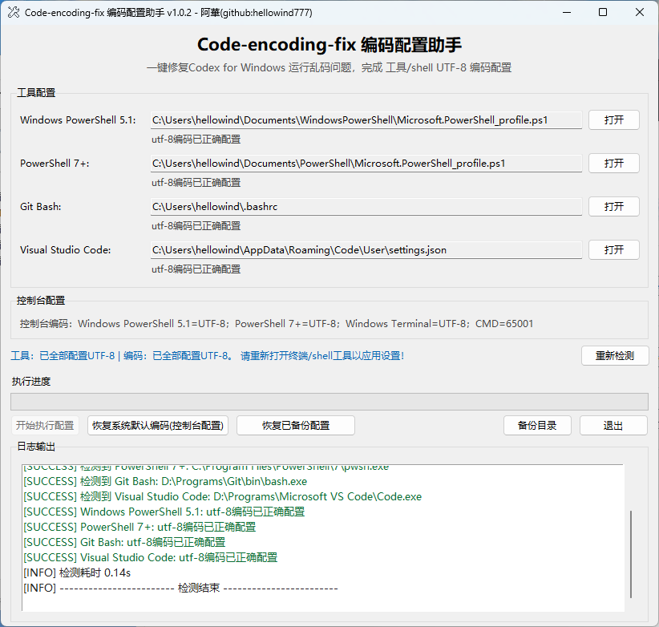
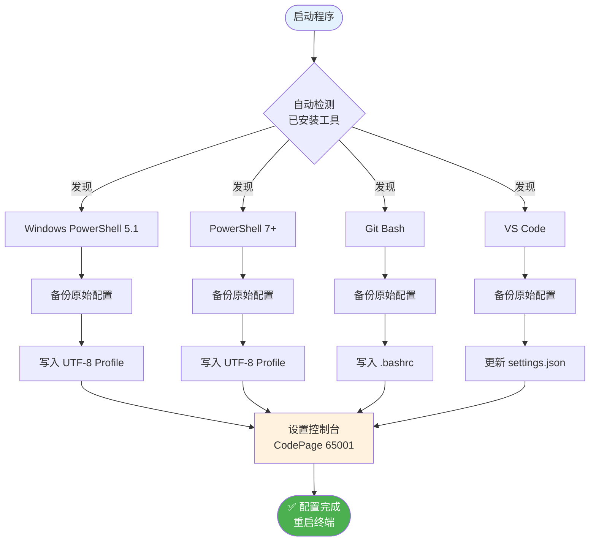

# Code-encoding-fix

<div align="center">

**一键配置 Windows 终端 UTF-8 编码 — 修复 Codex CLI、PowerShell、Git Bash 中文乱码问题**

[](./LICENSE)
[](./README_CN.md)
[](https://github.com/hellowind777/Code-encoding-fix/releases)
[](https://github.com/hellowind777/Code-encoding-fix/pulls)
[]()

[简体中文](./README_CN.md) · [English](./README.md) · [快速开始](#-快速开始) · [功能特性](#-功能特性)

</div>

---

> **重要提示：** 此工具专为 Windows 系统设计，可一键配置 PowerShell、Git Bash、VS Code 及 Windows 控制台的 UTF-8 编码，彻底解决中文乱码问题。

---

## 🖼️ 截图

<div align="center">
  
</div>

## 🎯 为什么需要 Code-encoding-fix？

**问题所在：** Windows 终端默认使用传统代码页（如中文系统的 CP936），导致在使用 Codex CLI、Claude Code 等现代开发工具时，中文字符显示为乱码。

**解决方案：** 一款 GUI 工具，自动检测并配置所有 Windows 终端和开发工具的 UTF-8 编码。

| 问题 | 没有 Code-encoding-fix | 使用 Code-encoding-fix |
|------|------------------------|------------------------|
| **终端中文输出** | 乱码（????或奇怪字符） | 正常显示 UTF-8 文本 |
| **Codex CLI / Claude Code** | 编码错误甚至崩溃 | 完美运行 |
| **多工具配置** | 手动编辑 4+ 个配置文件 | 一键完成 |
| **配置一致性** | 每个工具设置不同 | 统一 UTF-8 编码 |
| **回滚能力** | 难以恢复原状 | 内置备份与恢复 |

### 💡 适用场景
- ✅ **Windows 开发者**：遇到中文字符编码问题
- ✅ **Codex CLI / Claude Code 用户**：需要正确的 UTF-8 支持
- ✅ **团队协作**：需要 PowerShell、Git Bash、VS Code 编码一致
- ✅ **任何人**：厌倦了在多个工具中手动配置 UTF-8

### ⚠️ 不适用场景
- ❌ macOS 或 Linux 用户（原生 UTF-8 支持）
- ❌ 仅使用 ASCII/英文文本的用户
- ❌ 无法修改用户级注册表设置的系统

---

## ✨ 功能特性

### 🎯 核心能力

<table>
<tr>
<td width="50%">

**🔍 自动检测**

- 检测 Windows PowerShell 5.1
- 检测 PowerShell 7+
- 检测 Git Bash 安装位置
- 检测 VS Code 配置
- 检测 Windows Terminal

**您的收益：** 无需手动查找路径，工具自动完成所有检测。

</td>
<td width="50%">

**⚡ 一键配置**

- PowerShell 配置文件 UTF-8 设置
- Git Bash ~/.bashrc 编码配置
- VS Code settings.json
- 控制台注册表 CodePage (65001)

**您的收益：** 几秒钟完成所有工具配置，而非数小时。

</td>
</tr>
<tr>
<td width="50%">

**🔄 备份与恢复**

- 修改前自动备份
- 随时恢复到原始状态
- 每个工具独立备份
- "恢复系统默认"选项

**您的收益：** 安全实验——随时可以回滚。

</td>
<td width="50%">

**🛡️ 漂移检测**

- 检测手动配置修改
- 识别部分/损坏的配置
- 报告与预期的精确差异
- 自动清理残留标记

**您的收益：** 精确掌握配置变化，知道何时需要重新应用设置。

</td>
</tr>
</table>

### 📊 数据一览
- **4 个工具** 同时配置（PowerShell 5.1、PowerShell 7+、Git Bash、VS Code）
- **5 个控制台** CodePage 设置（PS5、PS7、Windows Terminal、CMD 等）
- **零** 手动文件编辑
- **100%** 可逆，内置恢复功能

---

## 🚀 快速开始

### 前置条件
- Windows 10 或更高版本
- Python 3.10+（从源码运行）或
- 从 [Releases](https://github.com/hellowind777/Code-encoding-fix/releases) 下载预编译的 `.exe`

### 安装

**方式一：下载预编译程序（推荐）**

```powershell
# 从 GitHub Releases 下载
# https://github.com/hellowind777/Code-encoding-fix/releases
# 直接运行 Code-encoding-fix.exe
```

**方式二：从源码运行**

```powershell
# 克隆仓库
git clone https://github.com/hellowind777/Code-encoding-fix.git
cd Code-encoding-fix

# 运行程序
python Code-encoding-fix.py
```

### 首次使用

1. **启动程序** — GUI 将自动检测所有已安装的工具
2. **点击"开始执行配置"** — 所有检测到的工具将被配置
3. **重启终端** — PowerShell、Git Bash、VS Code 需要重启以应用更改

**预期输出：**
```
[SUCCESS] 检测到 Windows PowerShell 5.1: C:\Windows\System32\WindowsPowerShell\v1.0\powershell.exe
[SUCCESS] 检测到 Git Bash: C:\Program Files\Git\bin\bash.exe
[SUCCESS] 检测到 Visual Studio Code: C:\Users\...\Code.exe
[SUCCESS] 已写入 Windows PowerShell 5.1 UTF-8 用户配置
[SUCCESS] 已写入 Git Bash UTF-8 用户配置
[SUCCESS] 已写入 Visual Studio Code UTF-8 用户设置
[SUCCESS] Windows PowerShell 5.1 控制台已设置为 UTF-8 代码页
```

### 验证安装

重启 PowerShell 后：
```powershell
# 检查当前代码页
chcp
# 预期：活动代码页: 65001

# 测试中文输出
echo "你好世界"
# 预期：你好世界（不是乱码）
```

---

## 🔧 工作原理

### 架构概览

<details>
<summary><strong>📊 点击查看完整架构图</strong></summary>



</details>

### 配置详情

<table>
<tr><th>工具</th><th>配置内容</th><th>配置位置</th><th>关键设置</th></tr>

<tr>
<td><strong>Windows PowerShell 5.1</strong></td>
<td>
• 控制台编码<br>
• 输入/输出编码<br>
• 默认参数编码<br>
• LANG 环境变量
</td>
<td>~\Documents\WindowsPowerShell\Microsoft.PowerShell_profile.ps1</td>
<td>
• chcp 65001<br>
• [Console]::*Encoding = UTF8<br>
• $PSDefaultParameterValues['*:Encoding'] = 'utf8'
</td>
</tr>

<tr>
<td><strong>PowerShell 7+</strong></td>
<td>
• 与 PowerShell 5.1 相同
</td>
<td>~\Documents\PowerShell\Microsoft.PowerShell_profile.ps1</td>
<td>
• 与 PS 5.1 相同的设置
</td>
</tr>

<tr>
<td><strong>Git Bash</strong></td>
<td>
• LANG/LC_ALL 变量<br>
• Git 编码设置<br>
• 控制台代码页
</td>
<td>~/.bashrc</td>
<td>
• export LANG="zh_CN.UTF-8"<br>
• git config --global core.quotepath false<br>
• git config --global i18n.commitencoding utf-8
</td>
</tr>

<tr>
<td><strong>VS Code</strong></td>
<td>
• 文件编码<br>
• 终端环境<br>
• 自动猜测编码
</td>
<td>%APPDATA%\Code\User\settings.json</td>
<td>
• "files.encoding": "utf8"<br>
• "terminal.integrated.env.windows": LANG/LC_ALL
</td>
</tr>

<tr>
<td><strong>控制台注册表</strong></td>
<td>
• 每个应用的 CodePage
</td>
<td>HKCU\Console\{app}</td>
<td>
• CodePage = 65001 (UTF-8)
</td>
</tr>

</table>

### 真实示例：配置前后对比

```
配置前（Windows 默认编码）：
  PowerShell 输出：????
  Git log：<E4><BD><A0><E5><A5><BD>
  VS Code 终端：浣犲ソ

配置后（UTF-8 已配置）：
  PowerShell 输出：你好世界
  Git log：修复编码问题
  VS Code 终端：你好世界
```

---

## 📖 文档

### 核心概念

<table>
<tr><th>概念</th><th>定义</th><th>重要性</th></tr>

<tr>
<td><strong>代码页 (Code Page)</strong></td>
<td>Windows 将字节序列映射为字符的系统。CP936 = GBK 中文，CP65001 = UTF-8</td>
<td>错误的代码页 = 乱码。UTF-8 (65001) 是现代通用标准。</td>
</tr>

<tr>
<td><strong>控制台编码</strong></td>
<td>终端应用程序用于输入/输出的编码</td>
<td>必须与 shell 和应用程序匹配才能正确显示。</td>
</tr>

<tr>
<td><strong>Profile 脚本</strong></td>
<td>PowerShell 启动时运行的脚本，用于配置环境</td>
<td>确保 UTF-8 设置在会话间持久保存。</td>
</tr>

<tr>
<td><strong>配置漂移</strong></td>
<td>实际配置与预期不符（手动编辑、更新等）</td>
<td>工具可检测漂移并重新应用正确设置。</td>
</tr>

</table>

### GUI 按钮说明

| 按钮 | 功能 | 使用场景 |
|------|------|----------|
| `开始执行配置` | 对所有检测到的工具应用 UTF-8 配置 | 首次设置或检测到漂移后 |
| `恢复配置` | 将所有工具恢复到配置前状态 | 想要撤销所有更改时 |
| `恢复系统默认(不含工具)` | 仅将控制台 CodePage 重置为系统默认 | 仅需重置控制台时 |
| `重新检测` | 重新扫描已安装工具并检查配置状态 | 安装新工具后 |
| `备份目录` | 打开备份存储文件夹 | 查看或管理备份 |
| `打开` | 打开该工具的配置文件 | 手动检查或编辑 |

---

## ❓ 常见问题

<details>
<summary><strong>Q: 需要管理员权限吗？</strong></summary>

**A:** 不需要。此工具仅修改用户级设置：
- 用户配置文件脚本（非系统级）
- 用户 VS Code 设置
- HKCU 注册表键（非 HKLM）

无需提升权限或管理员身份。
</details>

<details>
<summary><strong>Q: 会破坏我现有的 PowerShell 配置文件吗？</strong></summary>

**A:** 不会。工具会：
1. 在任何修改前创建备份
2. 使用清晰标记的块，可识别和移除
3. 提供一键恢复功能

您现有的配置文件内容在标记块外保持不变。
</details>

<details>
<summary><strong>Q: 为什么配置后需要重启终端？</strong></summary>

**A:** 终端在启动时加载配置。以下更改：
- PowerShell profile 脚本
- VS Code 设置
- 控制台注册表设置

...只有在应用程序重启并重新加载配置后才会生效。
</details>

<details>
<summary><strong>Q: 可以多次运行这个工具吗？</strong></summary>

**A:** 可以，工具是幂等的。它会：
- 检测现有配置块
- 写入新块前移除旧块
- 不会创建重复条目

多次运行是安全的，产生相同的结果。
</details>

<details>
<summary><strong>Q: 如果只安装了 Git Bash（没有 PowerShell 7）怎么办？</strong></summary>

**A:** 工具会自动检测已安装的内容。它会：
- 配置 Windows PowerShell 5.1（Windows 上始终存在）
- 跳过 PowerShell 7 并显示警告
- 配置 Git Bash
- 配置 VS Code（如果已安装）

缺失的工具会被跳过。
</details>

<details>
<summary><strong>Q: 这会影响系统级设置吗？</strong></summary>

**A:** 不会。所有更改都是用户范围的：
- Profile 脚本在您的用户 Documents 文件夹
- 注册表更改在 HKEY_CURRENT_USER 下
- VS Code 设置是每用户的

同一台机器上的其他用户不受影响。
</details>

<details>
<summary><strong>Q: 如何完全移除所有更改？</strong></summary>

**A:** 点击"恢复配置"以：
1. 从备份恢复所有 profile 脚本
2. 将控制台 CodePage 重置为原始值
3. 恢复 VS Code 设置
4. 清理备份文件

这会将一切恢复到配置前的状态。
</details>

---

## 🛠️ 故障排除

### PowerShell 配置后仍显示乱码

**问题：** 运行工具后中文字符仍然显示不正确。

**原因：** 终端未重启，或使用了不同的 PowerShell profile。

**解决方案：**
```powershell
# 1. 关闭所有 PowerShell 窗口
# 2. 打开新的 PowerShell 窗口

# 3. 验证 profile 已加载
$PROFILE
# 应显示：C:\Users\{用户名}\Documents\WindowsPowerShell\Microsoft.PowerShell_profile.ps1

# 4. 检查当前编码
[Console]::OutputEncoding
# 应显示：UTF-8 (CodePage 65001)
```

---

### "未检测到 PowerShell 7+" 警告

**问题：** 工具报告未找到 PowerShell 7，但您已安装。

**原因：** PowerShell 7 安装在非标准位置或未加入 PATH。

**解决方案：**
```powershell
# 检查 pwsh 是否可用
where.exe pwsh

# 如果未找到，添加到 PATH 或重新安装 PowerShell 7
# 下载地址：https://github.com/PowerShell/PowerShell/releases
```

---

### VS Code 终端仍有编码问题

**问题：** VS Code 集成终端显示乱码。

**原因：** VS Code 设置未重新加载，或工作区设置覆盖了用户设置。

**解决方案：**
```
1. 按 Ctrl+Shift+P
2. 输入 "Reload Window" 并回车
3. 检查项目中可能覆盖的工作区设置：
   .vscode/settings.json
```

---

### Git log 显示转义字符如 `<E4><BD><A0>`

**问题：** Git 提交信息显示为十六进制代码而非中文。

**原因：** Git 的 core.quotepath 设置为 true（默认）。

**解决方案：**
```bash
# 此工具会自动设置，但可验证：
git config --global core.quotepath
# 应返回：false

# 如果不是，手动设置：
git config --global core.quotepath false
```

---

### Windows 更新后检测到配置漂移

**问题：** 系统更新后工具报告"已偏离"（检测到漂移）。

**原因：** Windows 更新有时会重置注册表值或 profile 权限。

**解决方案：**
```
1. 点击"开始执行配置"重新应用设置
2. 工具会备份当前状态并重写正确的值
3. 重启受影响的终端
```

---

## 🤝 贡献

1. **Fork** 仓库
2. **创建** 功能分支 (`git checkout -b feature/amazing`)
3. **提交** 您的更改 (`git commit -m '添加惊艳功能'`)
4. **推送** 到分支 (`git push origin feature/amazing`)
5. **打开** Pull Request

### 贡献建议
- 🐛 发现 bug？[报告它](https://github.com/hellowind777/Code-encoding-fix/issues)
- 💡 有想法？[讨论它](https://github.com/hellowind777/Code-encoding-fix/discussions)
- 📝 改进文档？欢迎修复错别字的 PR！
- 🌍 翻译？我们需要日语、韩语等语言的帮助

---

## 🔒 安全性

**此工具使用安全：**

- ✅ 无网络请求 — 完全离线工作
- ✅ 无数据收集 — 您的设置保留在本地
- ✅ 仅用户范围 — 无系统级修改
- ✅ 可逆 — 内置备份和恢复

**代码审查：**
- 单个 Python 文件（约 2900 行）
- 仅使用 Python 标准库（tkinter、winreg、subprocess）
- 无外部依赖

---

## 许可证与署名（**允许商用，但必须注明出处**）

为确保"允许商用 + 必须署名"，本项目采用**双许可证**：

1. **代码** — **Apache License 2.0** © 2025 Hellowind
   - 允许商业使用。要求在分发中保留 **LICENSE** 与 **NOTICE** 信息（版权与许可说明）。
   - 在你的分发包中加入 `NOTICE`（示例）：
     <pre>
     本产品包含 "Code-encoding-fix"（作者：<a href="https://github.com/hellowind777/Code-encoding-fix">Hellowind</a>），依据 Apache License 2.0 授权。
     </pre>

2. **文档（README/图表）** — **CC BY 4.0** © 2025 Hellowind
   - 允许商业使用，但**必须署名**；需给出许可链接并标注是否做了修改。
   - 复用文档时建议的署名例句：
     <pre>
     文本/图表改编自 "Code-encoding-fix" —— © 2025 <a href="https://github.com/hellowind777/Code-encoding-fix">Hellowind</a>，CC BY 4.0。
     </pre>

3. **统一署名建议（代码与文档皆可）**：
     <pre>
     Code-encoding-fix — © 2025 <a href="https://github.com/hellowind777/Code-encoding-fix">Hellowind</a>. 代码：Apache-2.0；文档：CC BY 4.0。
     </pre>

---

## 🙏 致谢

**灵感来源：**
- Windows 上调试编码问题的挫败感
- [Codex CLI](https://github.com/openai/codex) 和 [Claude Code](https://claude.ai/claude-code) 团队
- Python 社区出色的 tkinter 文档

**社区：**
- 所有提交 PR 的贡献者
- 提供反馈的早期用户
- 您，读到这里！🎉

---

## 📞 支持与社区

- 📖 **文档**：您正在阅读它！
- 💬 **讨论**：[GitHub Discussions](https://github.com/hellowind777/Code-encoding-fix/discussions)
- 🐛 **Bug 报告**：[GitHub Issues](https://github.com/hellowind777/Code-encoding-fix/issues)
- 💡 **功能请求**：[GitHub Issues](https://github.com/hellowind777/Code-encoding-fix/issues)

---

## 📊 项目统计

<div align="center">


</div>

---

<div align="center">

**由 [Hellowind](https://github.com/hellowind777) 用 ❤️ 制作**

[⬆ 返回顶部](#code-encoding-fix)

</div>
